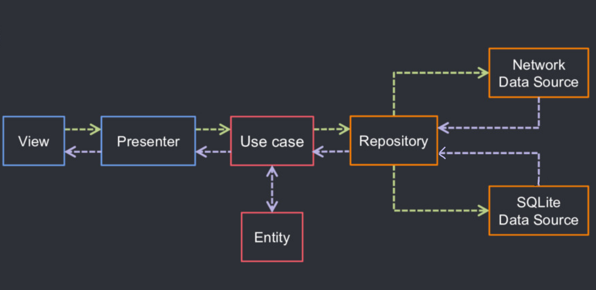

# Praxis

This is a sample app written in Kotlin following clean architecture principles which fetches random jokes and displays it.

The purpose of this app to showcase:
 - Implementation of Jetpack Android Architecture components with Dagger Android and Data Binding to minimize boilerplate code
 - Creation of proper components and Subcomponents using Dagger Android and their injection into Activity, Fragment, View Models and Helper Classes
 - Performing background task with Kotlin Coroutines

## Languages, libraries and tools used
 - [Kotlin](https://kotlinlang.org/)
 - [Kotlin DSL](https://docs.gradle.org/current/userguide/kotlin_dsl.html)
 - AndroidX libraries
 - [Android Architecture Components](https://developer.android.com/topic/libraries/architecture)
 - [Android Data Binding](https://developer.android.com/topic/libraries/data-binding)
 - [Dagger 2](https://github.com/google/dagger)
 - [Retrofit](http://square.github.io/retrofit/)
 - [OkHttp](http://square.github.io/okhttp/)
 - [Gson](https://github.com/google/gson)
 - [Kotlin Coroutines](https://developer.android.com/kotlin/coroutines)

## Architecture
Praxis follows the principles of Clean Code Architecture with Android Architecture Components & SOLID principles for -
1. Better separation of concerns.
2. Loosely coupled code leading to better reusability as a module.
3. Better Testing.

### Architecture's layers & boundaries:
The general idea of Clean Code Architecture is to divide an application into layers. Layers count depends on the requirement of the application, for praxis we are going with 3 Layer approach separating Application, Data & Domain Layers.

**Presentation Layer**  contains  _UI (Activities & Fragments)_  that are coordinated by  _ViewModels which execute 1 or multiple UseCases._  Presentation Layer depends on Domain Layer.

**Domain Layer** is the most INNER part of the circle (no dependencies with other layers) handling business logic of the application. It contains _Entities, Use cases & Repository Interfaces._ Data coming from one/more sources(Repository Implementations) are combined in the _Use case_ and further sent to ViewModel.

**Data Layer**  contains abstract definition of all the data sources, _Repository Implementations and 1 or multiple Data Sources._  Repositories are responsible to coordinate data from the different Data Sources. Data Layer depends on Domain Layer.

**Notes:** Mapping between response models and transformed models will happen via extension functions defined in transformed model file
### App Flow:

### Conventions:
Files are suffixed with be defined Class types.
 - ViewModels are suffixed with **VM**. Ex: `LoginVM`
 - UseCases are suffixed with **UseCase**. Ex: `LoginUseCase`
 - Sources are suffixed with **Source**. Ex: `LoginRemoteSource`, `LoginLocalSource`
 - Repositories are suffixed with **Repo**. Ex: `LoginRepo`

## Conclusion
This project can be used as a template for new apps.
This project is continually evolving to integrate other libraries and techniques to keep it up to date.
